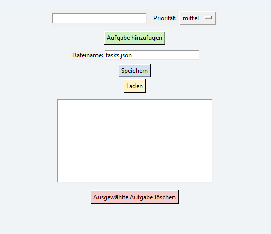

# 📝 To-Do-Liste mit Priorität (Tkinter GUI)

Dies ist eine einfache, aber hübsche To-Do-App mit Prioritäten, Speichern/Laden und Farbstyling – gebaut mit Python und Tkinter.

## ✨ Funktionen
- Aufgaben hinzufügen mit Priorität (hoch, mittel, niedrig)
- Automatische Sortierung nach Priorität
- Aufgaben speichern und laden aus benutzerdefinierter Datei
- Farben für bessere Übersicht
- GUI mit Eingabefeldern, Buttons und Liste

## ▶️ Verwendung
1. Aufgabe eingeben
2. Priorität auswählen
3. „Aufgabe hinzufügen“ klicken
4. Liste wird automatisch sortiert
5. Dateiname eingeben (z. B. `projekt.json`)
6. „Speichern“ oder „Laden“ klicken

## 📦 Installation
Python 3.x installieren – Tkinter ist in der Regel bereits enthalten.

Einfach testen:
```bash
python todo_gui.py
```



## 🛠️ Verwendete Technologien

- Python 3  
- Tkinter (GUI)  
- JSON (Speichern/Laden)

## 👩‍💻 Autor

Erstellt von Serena – mit viel Spaß und Lernfreude 😄

## 📄 Lizenz

Dieses Projekt kann frei verwendet und angepasst werden – für Lernzwecke, Spaß und persönliche Weiterentwicklung.


